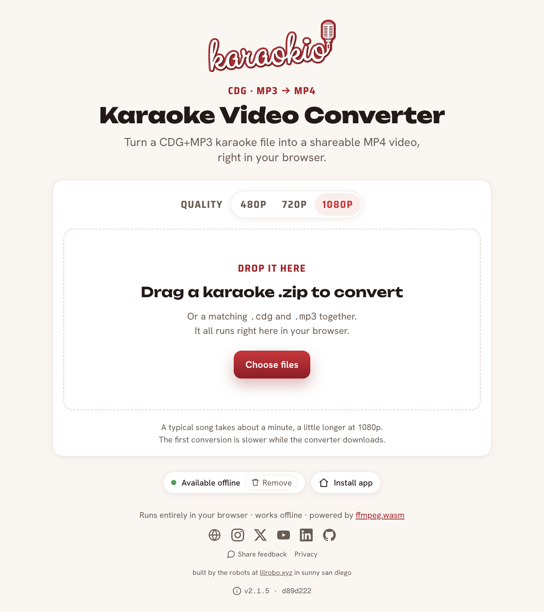

# Karaokio · CDG-to-MP4 Converter

Convert karaoke **CDG + MP3** files into shareable **MP4** videos, entirely in your
browser. No upload, no server, no account. Works offline once loaded.



It's powered by [ffmpeg.wasm](https://ffmpegwasm.netlify.app/): the FFmpeg transcode that
the old Flask/Celery/S3 backend used to run on a server now runs client-side in WebAssembly.
Your files never leave your machine.

> This app is also the reference implementation for the Karaokio platform stack:
> **React + Vite + Tailwind v4** on the shared shadcn-style design system.

## Stack

- **React 19 + Vite 6 + TypeScript** is a static SPA, no backend.
- **Tailwind v4** + the Karaokio design system (`src/styles/tokens/`, `src/components/ui/`).
- **ffmpeg.wasm** single-thread `@ffmpeg/core`, copied into `public/ffmpeg/` at build time
  and served same-origin (offline-capable). Single-thread is deliberate: the multi-thread
  core deadlocks at x264 init, and single-thread needs no COOP/COEP cross-origin-isolation
  headers, which keeps deployment trivial.
- **fflate** does in-browser unzip of the karaoke `.zip`.
- **PWA** via `vite-plugin-pwa`: the app shell is precached for offline reload, and the
  31MB ffmpeg core is runtime-cached on first use (so first paint stays fast). An
  "Available offline" pill shows cache status and lets users save or clear the converter
  (~30MB). Updates are prompted, never forced mid-conversion. Installable on desktop/mobile.

## Develop

```bash
npm install
npm run dev      # http://localhost:5173  (copies the ffmpeg core into public/ first)
```

## Build & preview

```bash
npm run build    # type-checks, copies the core, bundles to dist/
npm run preview
```

## Deploy

Any static host. The build output in `dist/` is fully self-contained, with no headers or
runtime required. Recommended: **Cloudflare Pages** (`build command: npm run build`,
`output: dist`).

## How it works

1. Drop a karaoke `.zip` (or a matching `.cdg` + `.mp3`) onto the page.
2. `src/lib/zip.ts` extracts the CDG (graphics) and MP3 (audio) streams.
3. `src/lib/ffmpeg.ts` runs:
   `ffmpeg -i in.cdg -i in.mp3 -r 30 -s 640x480 -c:v libx264 -preset veryfast -pix_fmt yuv420p -c:a aac -shortest out.mp4`
4. The MP4 is offered as an in-page preview and a download.

## Project layout

```
src/
  components/
    ui/             reused design-system primitives (Button, Surface, Label, Spinner)
    Converter.tsx   the dropzone → convert → preview/download flow
  lib/
    ffmpeg.ts       ffmpeg.wasm loader + convertCdgToMp4()
    zip.ts          extract cdg+mp3 from a zip
  styles/
    index.css       Tailwind + token imports + keyframes
    tokens/         Karaokio design tokens (primitives/semantic/theme)
scripts/
  copy-ffmpeg-core.mjs   copies @ffmpeg/core into public/ffmpeg/ (pre dev/build)
  make-sample-cdg.py     generates the copyright-free CDG test card
test/files/         self-generated, copyright-free sample.{cdg,mp3,zip} fixtures
```

## Test fixtures

`test/files/sample.*` are generated from scratch and contain no copyrighted
material: a hand-authored CDG color-bar test card (`scripts/make-sample-cdg.py`)
paired with a synthetic tone. Regenerate with:

```bash
python3 scripts/make-sample-cdg.py
ffmpeg -f lavfi -i "sine=frequency=440:duration=8" -f lavfi -i "sine=frequency=554:duration=8" \
  -filter_complex "[0][1]amix=inputs=2,volume=0.25" -c:a libmp3lame -q:a 5 test/files/sample.mp3
```
