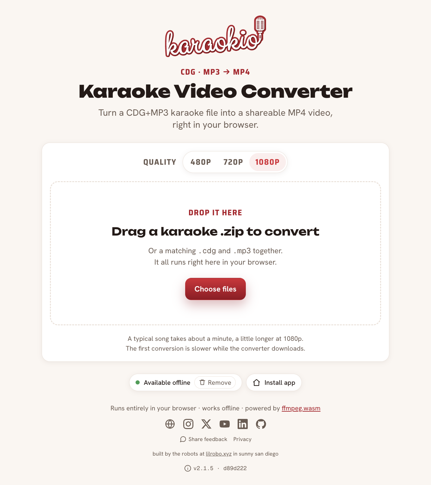

# Karaokio · CDG-to-MP4 Converter

Convert karaoke **CDG + MP3** files into shareable **MP4** videos, entirely in your
browser. No upload, no server, no account. Works offline once loaded.



The transcode that the old Flask/Celery/S3 backend ran on a server now runs client-side.
There are two converters and the app picks one per device: a **native** pipeline built on
[WebCodecs](https://developer.mozilla.org/en-US/docs/Web/API/VideoEncoder), and
[ffmpeg.wasm](https://ffmpegwasm.netlify.app/) as the fallback. Either way your karaoke
files are converted on your machine and never uploaded. (We do collect anonymous usage
analytics to improve the tool, see [Privacy](#privacy).)

> This app is also the reference implementation for the Karaokio platform stack:
> **React + Vite + Tailwind v4** on the shared shadcn-style design system.

## Stack

- **React 19 + Vite 6 + TypeScript** is a static SPA, no backend.
- **Tailwind v4** + the Karaokio design system (`src/styles/tokens/`, `src/components/ui/`).
- **Native pipeline** (preferred): [`cdgraphics`](https://www.npmjs.com/package/cdgraphics)
  renders CDG frames to a canvas, `VideoEncoder` encodes H.264 in the browser's own
  (often hardware) encoder, and [`mediabunny`](https://mediabunny.dev) muxes the MP4.
  It all runs in a worker, so the UI stays responsive and Cancel is a `terminate()`.
  Nothing to download, and no wasm engine involved, so it also runs on CPUs without
  SSE4.1 where the wasm core cannot compile at all.
- **ffmpeg.wasm** fallback, for browsers without `VideoEncoder` or without an H.264
  encoder config the device accepts, and one click away on the error screen if a native
  conversion fails anyway. Single-thread `@ffmpeg/core`, copied into
  `public/ffmpeg/` at build time and served same-origin (offline-capable). Single-thread
  is deliberate: the multi-thread core deadlocks at x264 init, and single-thread needs no
  COOP/COEP cross-origin-isolation headers, which keeps deployment trivial.
- **fflate** does in-browser unzip of the karaoke `.zip`.
- **PWA** via `vite-plugin-pwa`: the app shell is precached for offline reload, and the
  31MB ffmpeg core is runtime-cached on first use (so first paint stays fast). The
  "Available offline" pill reflects that; on the native pipeline there is nothing to
  download, so it reads "Available offline" from the start. Updates are prompted, never
  forced mid-conversion. Installable on desktop/mobile.

## Develop

```bash
npm install
npm run dev      # http://localhost:5173  (copies the ffmpeg core into public/ first)
```

Note: the **service worker is disabled in dev** (`devOptions.enabled: false`), so the
offline behavior and the "Available offline" pill do **not** work under `npm run dev`.
Use the production preview below to test anything PWA related.

## Build & preview (and how to test offline)

```bash
npm run build    # type-checks, copies the core, bundles to dist/
npm run preview  # serves the built app at http://localhost:4173 (service worker active)
```

To test offline support:

1. Open http://localhost:4173 and convert a file once. The pill turns green
   ("Available offline") as the ffmpeg core gets cached.
2. In DevTools, go to **Network** and switch to **Offline** (or tick Offline under
   **Application → Service Workers**), then reload. The app should still load and convert.
3. **Clear** on the pill removes the cached core (~30MB) and the dot goes grey.

Iterating gotcha: a service worker caches the previous build, so after re-running
`npm run build`, tick **"Update on reload"** in DevTools → Application → Service Workers,
or use **Clear site data**, to avoid serving stale files.

### Testing install / on a phone

`localhost` works for desktop, but installing the PWA or testing on a phone needs HTTPS.
Either deploy it, or tunnel the preview to a temporary HTTPS URL:

```bash
npm run preview
npx cloudflared tunnel --url http://localhost:4173   # open the https URL on your phone
```

## Deploy

Any static host. The build output in `dist/` is fully self-contained, with no headers or
runtime required. Recommended: **Cloudflare Pages** (`build command: npm run build`,
`output: dist`).

## How it works

1. Drop a karaoke `.zip` (or a matching `.cdg` + `.mp3`) onto the page.
2. `src/lib/zip.ts` extracts the CDG (graphics) and MP3 (audio) streams.
3. `src/lib/ffmpeg.ts` runs:
   `ffmpeg -i in.cdg -i in.mp3 -r 30 -vf "scale=1440:1080:flags=neighbor,tpad=stop_mode=clone:stop=-1" -c:v libx264 -preset veryfast -pix_fmt yuv420p -c:a aac -shortest out.mp4`
4. The MP4 is offered as an in-page preview and a download.

## Privacy

The conversion is 100% local: your karaoke **file contents are never uploaded** and there is
no backend or account. The app does collect a little to help improve it:

- **Anonymous product analytics** ([PostHog](https://posthog.com)): conversion events with
  properties like resolution, input type, duration, and the **filenames** (the zip / cdg / mp3
  you drop and the resulting mp4), never the file contents. No exact file sizes; bot traffic
  is filtered out.
- **Feedback you choose to send** ([Tally](https://tally.so)): only what you type into the
  feedback form, plus the build/context it was sent from.

Both are off in development and only active when their keys are configured. See
[`PRIVACY.md`](PRIVACY.md) for the full rundown.

## Project layout

```
src/
  components/
    ui/             reused design-system primitives (Button, Surface, Label, Spinner)
    Converter.tsx   the dropzone → convert → preview/download flow
  lib/
    convert.ts      picks a pipeline (?pipeline= forces one) and runs it
    log.ts          the console trace of a conversion (see below)
    webcodecs.ts    native pipeline: capability detection + worker lifecycle
    webcodecs/
      encode.ts     the native pipeline itself (cdgraphics + WebCodecs + mediabunny)
      worker.ts     runs encode.ts off the main thread
    ffmpeg.ts       ffmpeg.wasm loader + convertCdgToMp4()
    zip.ts          extract cdg+mp3 from a zip
  styles/
    index.css       Tailwind + token imports + keyframes
    tokens/         Karaokio design tokens (primitives/semantic/theme)
scripts/
  copy-ffmpeg-core.mjs   copies @ffmpeg/core into public/ffmpeg/ (pre dev/build)
  make-sample-cdg.py     generates the copyright-free CDG test card
test/files/         self-generated, copyright-free sample.{cdg,mp3,zip} fixtures,
                    plus sample-key.cdg (transparent background, see the spec)
```

## Watching a conversion

Open the browser console. Every conversion prints a short trace: which pipeline
was chosen and why, the frame count against the audio and graphics lengths, the
audio codec, and a final line with size and realtime factor.

```
[cdg2mp4] pipeline: webcodecs — native H.264 encoder, nothing to download
[cdg2mp4] converting sample.zip at 1080p (1440x1080)
[cdg2mp4] encoding 1440x1080 H.264 in a worker
[cdg2mp4] audio: re-encoding the MP3 to AAC
[cdg2mp4] 242 frames at 30fps — 8.0s of audio, 8.0s of graphics
[cdg2mp4] encoded 0.1 MB in 0.7s
[cdg2mp4] done in 0.7s — 0.1 MB, 11.2x realtime
```

It is always on rather than behind a flag, because it is only useful if it is
already there when something goes wrong. That only works if it stays quiet, so
the budget is a handful of lines per conversion: nothing per frame, nothing per
packet. Filenames appear; file contents never do.

## Test fixtures

`test/files/sample*` are generated from scratch and contain no copyrighted
material: a hand-authored CDG color-bar test card (`scripts/make-sample-cdg.py`)
paired with a synthetic tone. Regenerate with:

```bash
python3 scripts/make-sample-cdg.py
ffmpeg -f lavfi -i "sine=frequency=440:duration=8" -f lavfi -i "sine=frequency=554:duration=8" \
  -filter_complex "[0][1]amix=inputs=2,volume=0.25" -c:a libmp3lame -q:a 5 test/files/sample.mp3
```
